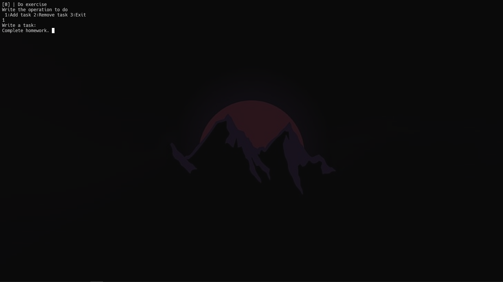
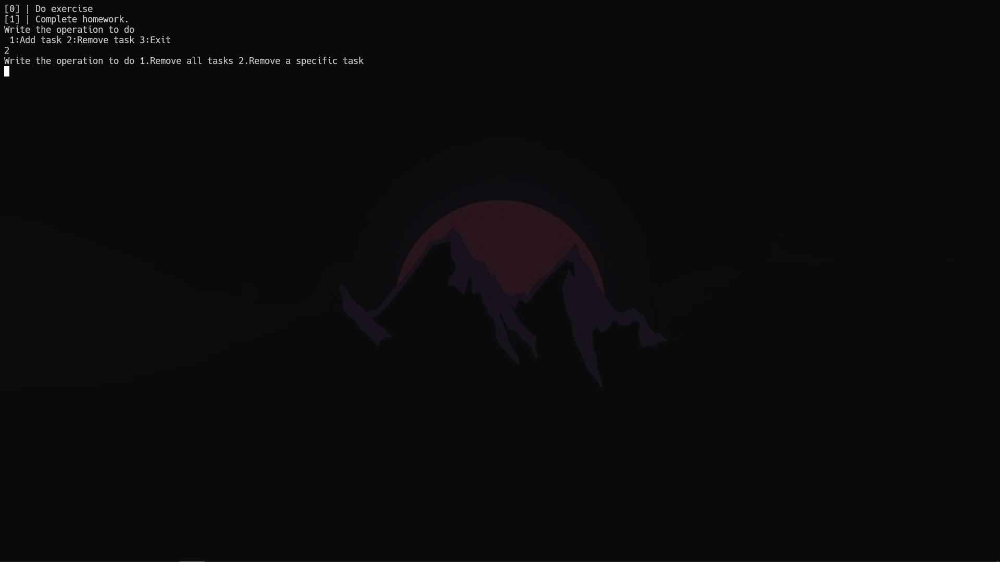
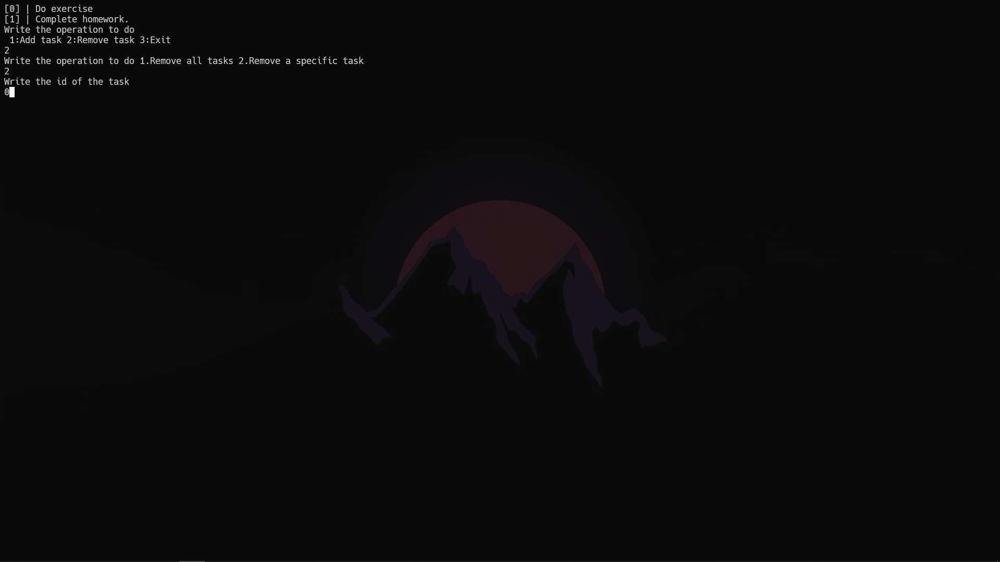

# ToDo List CLI made with **C#**
## Description
### This is a ToDO list CLI made with C#. With this we can add tasks, delete specific tasks or clear all tasks.

## Special things
### The tasks you add are saved in a file and when you reopen the program the tasks remain there.

## Some screenshots

You can add tasks.
#

You can choose to remove all the tasks or specific tasks. 
#

You can input id of the tasks that you want to remove which is the number in the large brackets ([]).
# 

## Requirements
- Git
- Dotnet SDK

## Installation
```bash
git clone https://github.com/PhaijooBaibhaav/ToDo-List-CLI
cd ToDo-List-CLI
dotnet run
```
